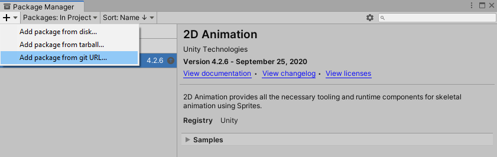
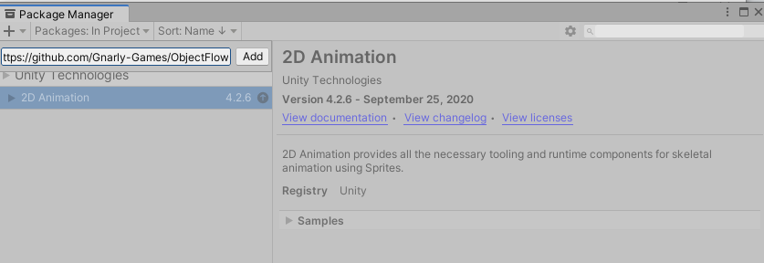
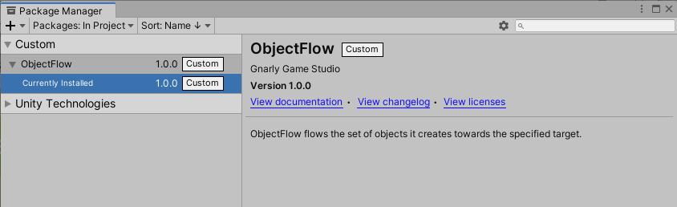
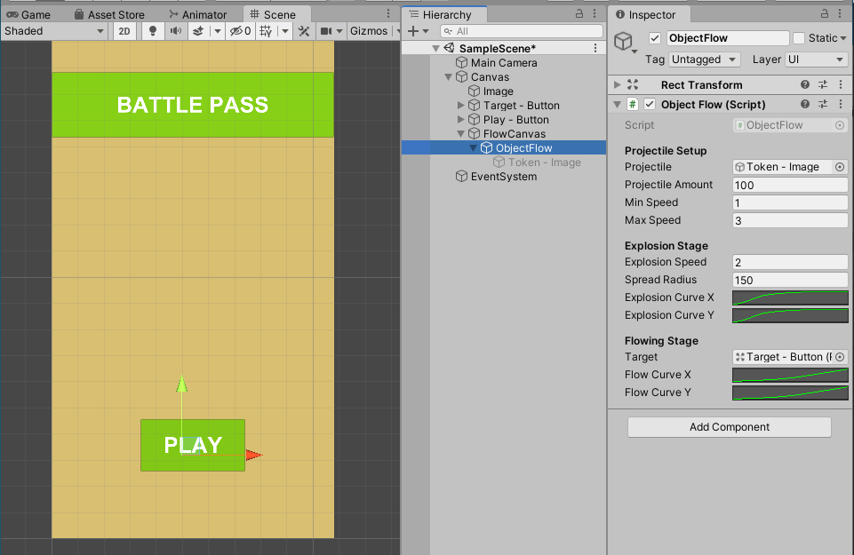
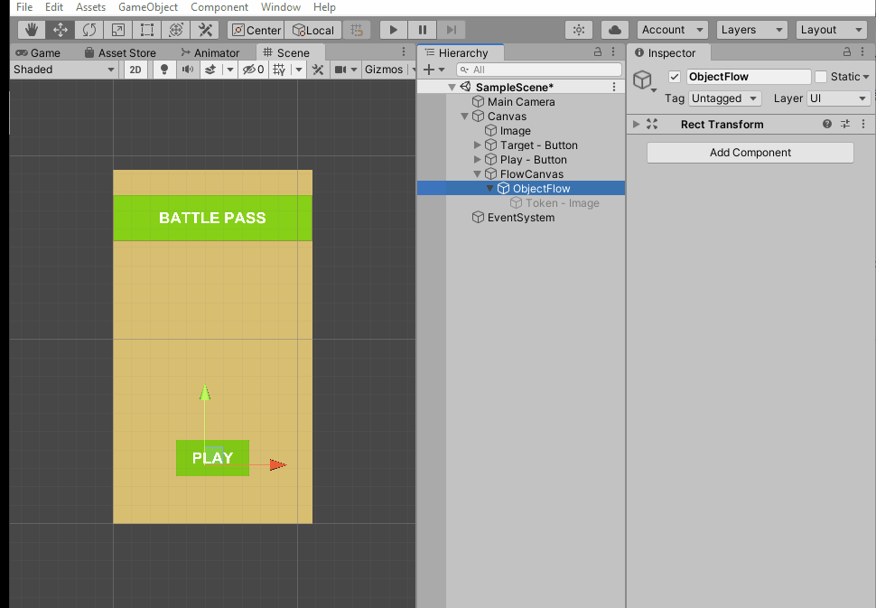

# ObjectFlow
ObjectFlow flows the set of objects it creates towards the specified target.

*This package is not dependent on any additional libraries.*

# Installation
1. Copy `https://github.com/Gnarly-Games/ObjectFlow.git`
2. Open the package manager by following `Window -> Package Manager`
3. Click **Add package from git URL** and paste the URL.

# How To Use

> ## ❗ Important   
> Always use the ObjectFlow in a seperate canvas.  
> UI elements are not designed to be created hundreds at a time.   
> Creating frequently updated objects in a separate canvas will prevent other UI elements from getting dirty.  
> Canvas can also be a subcanvas of the canvas you are currently using.  
> Read [this article](https://unity3d.com/how-to/unity-ui-optimization-tips) from Unity for more information.

1. Create a child canvas within your canvas.
2. Create a GameObject within the child canvas.
3. Add `ObjectFlow` script to the `GameObject`.
4. Define projectile amount and speed.
5. Define explosion radius and speed. Tweak the Animation Curves of the explosion.
6. Assign the **target** `GameObject` and tweak the Animation Curves of the **flow path**.
7. Invoke the `ObjectFlow.Flow()` method.

# Demo Video
If you have trouble using the package, try to follow the steps by watching the demo video. 

# License
`ObjectFlow` is offered under the Apache 2 license.
